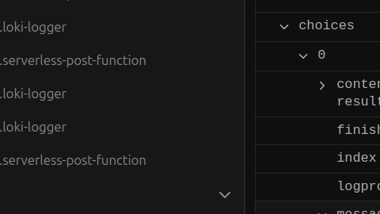

# apisix-ai-gateway-openbao-foundry-vertex-otel-langfuse-grafana-prometheus-dockercompose
Scripts do Docker Compose para subida de um ambiente do APISIX com capacidades de AI Gateway. Inclui gerenciamento de secrets via OpenBao e monitoramento com OpenTelemetry + Grafana + Prometheus + Langfuse, com coleta de traces, métricas e logs. IAs testadas: Microsoft Foundry e Google Vertex.

## Testes

Trace registrado no Langfuse e que contém as diversas interações no APISIX ao se invocar um endpoint de IA, incluindo o acesso a um vault do OpenBao:

